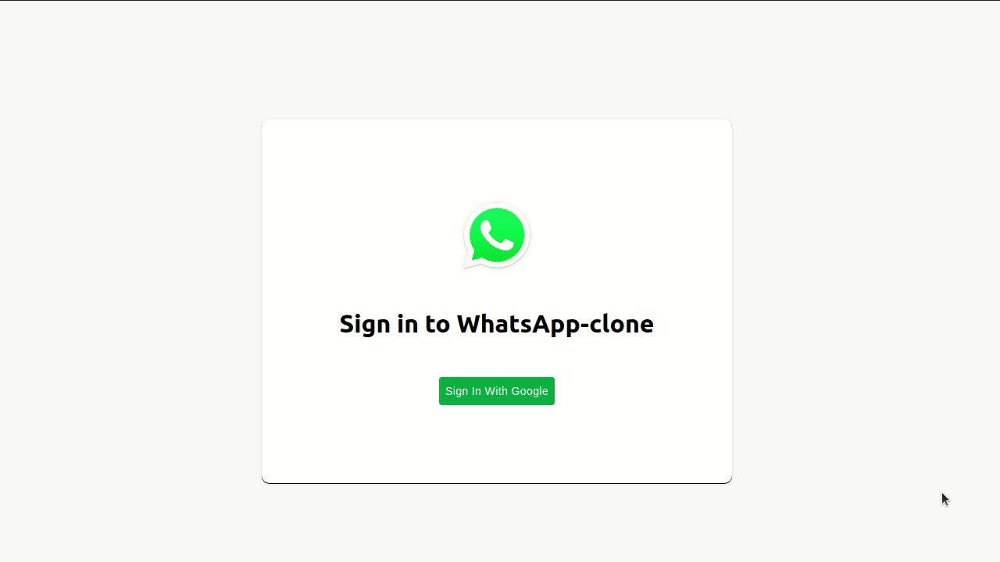

This is a whatsapp clone project , design is built with Material UI Icons and
Avatar with dicebear API. React Router is used for navigation from login screen
to main chat screen. React Context API is used for state management. Google
authentication and deployment is done using firebase. Funtionality to add new
chat room and chatting functionality is there.

## Demo

